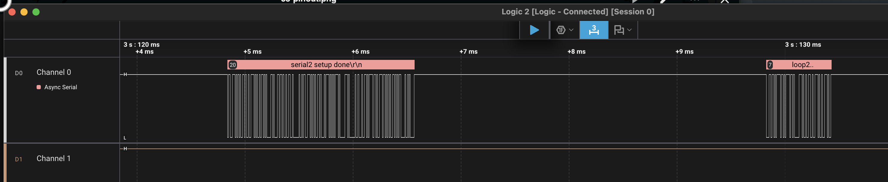

# PWM signal generator for ESP32

Test project to generate PWM signal to drive LED and mirror UART on user defined GPIO when using USB-CDC to debug with logic analyzer.

My ESP32-C3 pinouts are:

- GPIO21 - UART Tx
- GPIO8 - Blue LED

## logic analyzer - uart 

115200 8-N-1

